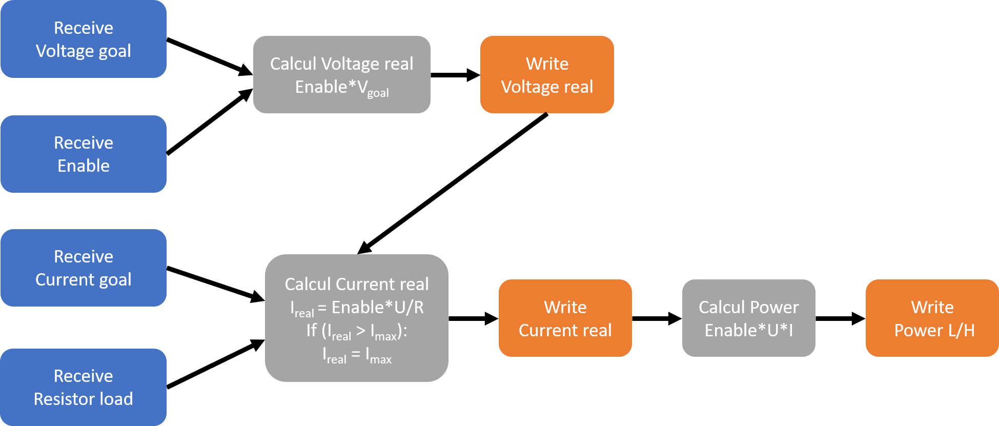

# Pza Emulator for hanmatek/hm310t power supply

The **main goals** of this emulator are:

- to provide the exact same USB interface that the **hanmatek/hm310t** power supply.
- to run on a RaspberryPi Pico H to be cheap and easily integrated on a test bench.

`Why not virtual USB interfaces ?`

To have a solution independent from OS and their implementation specificities

# Firmware logic

# Limitation

When using the Panduza plateform, the State send by the Client (client.py) must be True. Otherwise (False or something else) the controle of the Pico crashes.

# Build and run project

This project has a github actions workflow that build the Pico firmware. The firmware can be download and copy on the Pico in bootsel mode.

Otherwise, the project can be build with the following commmand :

    mkdir build
    cd build
    cmake ..
    make
    cp file_name.uf2 /media/<user>/RPI-RP2/

# Run test

## Method 1. With Modbus (No Panduza)

Get the tty port of the pico in /dev.

Modify the port in tests/rsc/Client.py file

    self.master = ModbusSerialClient(framer=ModbusRtuFramer, port = '/dev/<pico_tty_port>', stopbits=1, bytesize=8, parity='N', baudrate=115200)

Execute :

    cd tests/robot
    sudo chmod 777 /dev/<pico_tty_port>
    robot psu.robot

## Method 2. With Panduza plateform

Start Panduza plateform (panduza-py)

Run :

    python3 client.py

